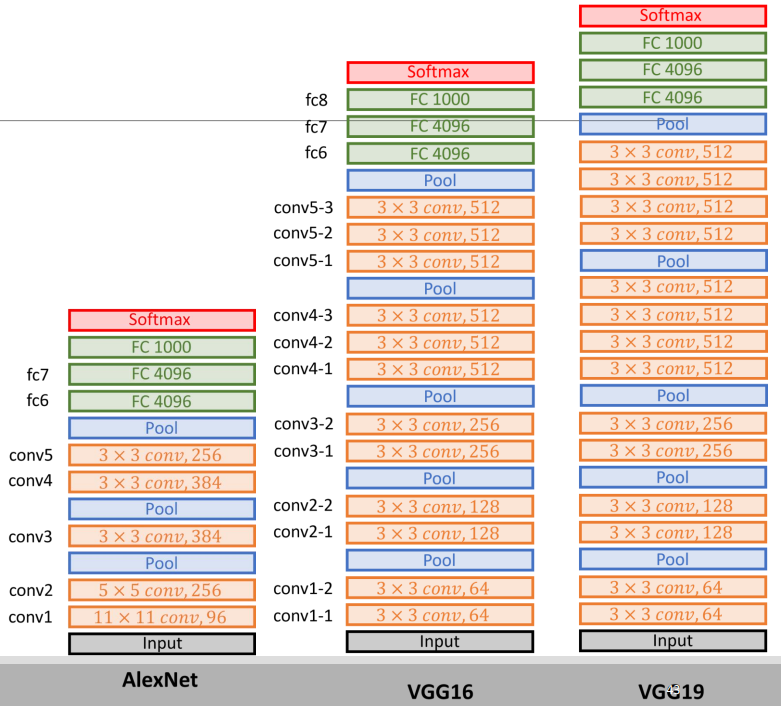
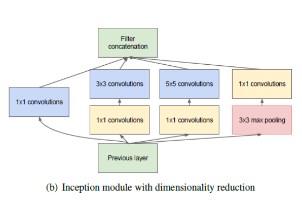
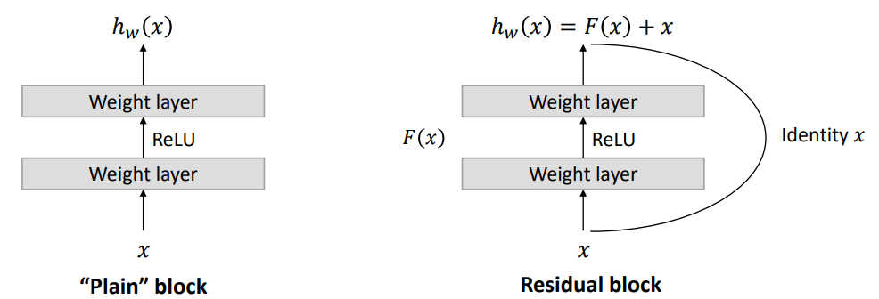

## Transfer learning

Replace the last fully connected layer to fit the new task.

For small datasets, only replace last layer to avoid overfitting.

For large datasets, replace more layers. Can reduce number of connections to reduce overfitting.

Freeze the rest of the network and train only the FC layer.

### Fine-tuning

Unfreeze some layers and train them with a lower learning rate to improve performance by adapting to the new data.

Feature extraction might not fit the new data well.

## Convolutional Network architectures

$$
\begin{align*}
\text{Input} &: W_1 \times H_1 \times D_1 \\
\text{Kernel} &: F \times F\\
\text{Stride} &: S \\
\text{Padding} &: P \\
\text{Output} &: W_2 \times H_2 \times D_2 \\
W_2 &= \frac{W_1 - F + 2P}{S} + 1 \\
H_2 &= \frac{H_1 - F + 2P}{S} + 1 \\
D_2 &= \text{Number of kernels} \\
\text{Number of parameters} &= (F \times F \times D_1) \times D_2
\end{align*}
$$

#### Batch normalization

AlexNet used local response normalization, but this is not used anymore. Instead, batch normalization is used.

$z^N = \frac{z - mean_z}{sd_z}$

### AlexNet

Data augmentation: Random crops and horizontal flips.

- **Input**: 227x227x3
- Random crop from 256x256x3
- **Conv1**: 96 11x11 filters, stride 4, ReLU
- Output: 55x55x96
- **Max pool 1**: 3x3, stride 2
  - Output: 27x27x96
- **Response norm 1**:
- **Conv2**: 256 5x5 filters, stride 1, ReLU
  - Output: 27x27x256
- **Max pool 2**: 3x3, stride 2
  - Output: 13x13x256
- **Response norm 2**
- **Conv3**: 384 3x3 filters, stride 1, pad 1, ReLU
  - Output: 13x13x384
- **Conv4**: 384 3x3 filters, stride 1, pad 1, ReLU
  - Output: 13x13x384
- **Conv5**: 256 3x3 filters, stride 1, pad 1, ReLU
  - Output: 13x13x256
- **Max pool 3**: 3x3, stride 2
  - Output: 6x6x256
  - Reshape to 1x9216 for FC layers
- **FC6**: 4096 neurons, ReLU
  - Dropout 1: 0.5
- **FC7**: 4096 neurons, ReLU
  - Dropout 2: 0.5
- **FC8**: 1000 neurons, softmax

### ZF

Change Conv1 to 7x7 stride 2, pad 3.

CONV3,4,5: instead of 384, 384, 256 filters use 512, 1024, 512

### VGG Net

Deeper network, smaller filters.

Stack of 3 3x3 filters is equivalent to 7x7 filter. **Less parameters**.

$$
1 * 7 * 7 * 3 = 147 \\
3 * 3 * 3 * 3 = 81
$$

Batch normalization is used.

### GoogLeNet (Inception)

Reduce number of operations to be able to increase depth of the network.

Use 1x1 convolutions at the middle of the network.

Number of operations for 5x5x48 convolution = $14*14*48*5*5*16 = 112.9M$

First reduce dimensionality with 1×1 convolutions with 1x1x16 kernels.
Then apply 5x5x48 convolutions.

- Number of operations for 1×1 = (14×14×16)×(1×1×480) = 1.5M
- Number of operations for 5×5 = (14×14×48)×(5×5×16) = 3.8M
- Total number of operations = $1.5M + 3.8M = 5.3M$ (much smaller than 112.9M !!!)
- 1×1 convolution can help to reduce model size (and reduce the overfitting problem!!!)

#### Inception module

Stack of convolutions with different kernel sizes and stacked together for the output

#### Global average pooling

Use Global Average Pooling (GAP) instead of FC layers. You average each feature map and get a single number. This is the output of the network.

Improves performance and reduces overfitting.

### ResNet

Deeper networks perform worse, but its not due to overfitting. Instead its because of **vanishing gradients**.

#### Vanishing gradients

The gradients become exponentially smaller as you go deeper in the network. This is because the gradient is the product of the gradients of each layer. If the gradient is smaller than 1, the gradient will become smaller and smaller.

ResNet solves this by using **skip connections**. The output of a layer is added to the output of a layer further down the network. This means that the gradient is at least 1, and the gradient will not vanish.

### MobileNet

Depthwise Separable Convolution

### U-Net

### Siamese nets (and one-shot learning)

[Go back](main.md)
