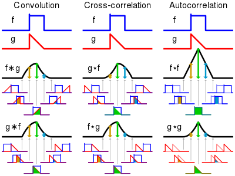

## Convolutional neural networks

Neural networks are fully connected, meaning that all nodes are connected to all other nodes in the next layer.

We would need a node to detect each feature in the picture which would be a waste.

Use convolution (encoder) to detect each feature and limit the number of parameters. Use NN (decoder) to combine the features in the end.

### Feature extraction using convolution

Convolution is a function that describes how two functions $f$ and $g$ are affected by each other. It is defined as the integral of the product of the two functions after one is reversed and shifted.

$$
(f * g)(t) = \int_{-\infty}^{\infty} f(\tau)g(t - \tau) d\tau
$$

The output neuron is only connected to the small region of the input defined by the kernel.

We stride the kernel over the input and calculate the output for each position. You might need to pad the input to get the same size output or change the size of the stride according to the size of the kernel.

#### Sparse interactions

Now output neurons dont have to be connected to all input neurons. Where a 100x100 px image would have 10,000 connections, a 5x5 kernel would only have 25 connections.

#### Parameter sharing

Instead of having a weight for each input cell, we can train and reuse the weights developed by the kernel.

#### Equivariant representations

Even small changes in higher layers are translated to small changes in the lower layers. Essentially, this means that the same object, even if moved a bit, will fire the neuron that detects it.

### Convolution layers

We're working on a volumes, e.g. a 512x512x3 image. We're using a 5x5x3 kernel, this would allow us to only require 75 weights. We use multiple kernels to get multiple outputs.

Using $N$ kernels of size 5x5x3, we get a 508x508xN output.

Each layer created by a filter/kernel is called a **feature map**. Combining multiple feature maps creates a **convolution layer**.

Combining more layers, allows for lower level inputs to be indirectly influenced by more features of the input and handling more complicated interactions.

**Output size**:

$$
\frac{N-W}{S} + 1
$$

Where $N$ is the input size, $W$ is the kernel width and $S$ is the stride.

You can use **zero-padding** to get the same size output as the input.

#### Overview Convolutional layer

$$
\begin{align*}
\text{Input} &: W_1 \times H_1 \times D_1 \\
\text{Kernel} &: F \times F\\
\text{Stride} &: S \\
\text{Padding} &: P \\
\text{Output} &: W_2 \times H_2 \times D_2 \\
W_2 &= \frac{W_1 - F + 2P}{S} + 1 \\
H_2 &= \frac{H_1 - F + 2P}{S} + 1 \\
D_2 &= \text{Number of kernels} \\
\text{Number of parameters} &= (F \times F \times D_1) \times D_2
\end{align*}
$$

Each convolutional layer requires an activation function. The most common is the ReLU function. This is to make the model more accurate by reducing linearity caused by the conv layer.

It also makes calculation the gradient faster for training.

### Pooling layers

Reduces the number of weights.

Most often use Max-pooling, which takes the maximum value of a region. This is to reduce the size of the input and to make the model more robust to changes in the input. I.e. if the neuron detects an eye, it doesn't matter if the eye moves a few pixels. This is called **translation invariance**.

Sometimes, use average pooling, which takes the average value of a region.

Deprecation: We need spatial information thrown away by max pooling. Could use CONV with stride 2 instead. This downsizes the output the same way, but keeps some of the spatial information.

#### Use pooling to get input of fixed length

Use pooling to get the right input size for softmax.

### Fully connected layers

The classifier, usually called "dense", "linear" or "fully connected" layers.

### Basic ConvNet architectures

#### LeNet-5

First ever ConvNet architecture. Used for handwritten digit recognition.

[Go back](main.md)
