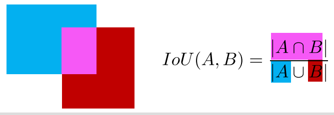
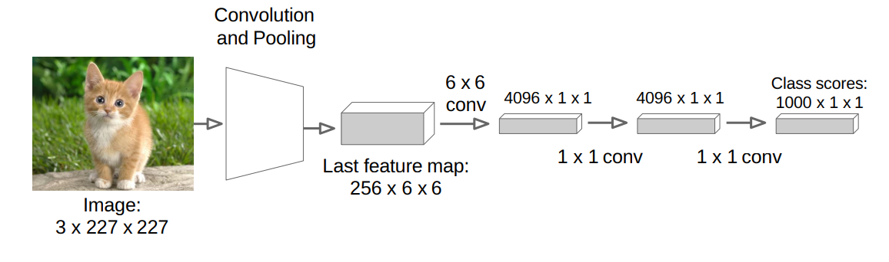
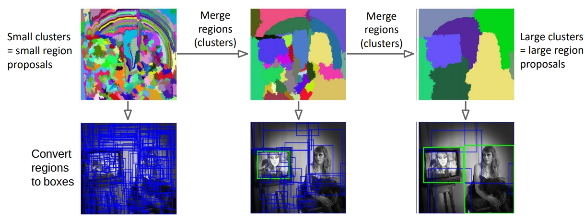
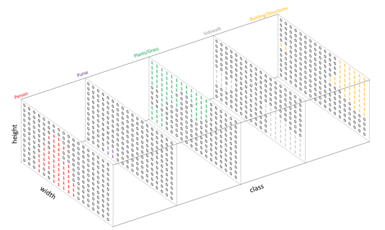

## Object Detection and Segmentation

### Object localisation

Output $(x,y,w,h)$. Evaluation with **Intersection over the Union** with the actual bounding box.

Localisation as a regression problem. $L2Distance(x,y,w,h) = \sum_{i}^{[x,y,w,h]} (i_{true} - i_{predicted})^2$.

1. Use pre-trained classifier. Add the localisation regression head beside the fully connected classifier.

### Sliding window (Overfeat)

Slide a window over the image and run the classifier on each window. This is very slow.

Convert fully connected layers to convolutional 1x1 layers

Due to different size objects. This needs an augment.

Run object localisation on each window slide and output both the class and the bounding box for each window.

Greedily connect the bounding boxes or use non-maximum suppression to output the best bounding box.

Use different sizes of the image to detect different sizes of objects.

### Selective search

Detect regions that are likely to contain objects and run the classifier on these regions.

Group similar pixels together. Can be grouped by color, texture, size, shape, etc.

Bottom-up segmentation. Recursively group regions together.

### R-CNN

Run region proposals on the image. Run the classifier like AlexNet on each region proposal.

Regions must be warped to the AlexNet input size.

Use a SVM to classify the region proposal. Combine with regression head to output more precise bounding box.

### Fast R-CNN

Run convolutional network on the whole image. Run region proposals on the convolutional feature map and reshape to dense layer input size with a ROI pooling layer.

#### Faster R-CNN

Instead of using selective search on the convolutional feature map, use a separate network to predict the region proposals.

#### YOLO

Split image into SxS grid and run bounding-box regression on each grid cell. Each grid cell outputs M bounding boxes with confidence score.
For each grid cell, output class probabilities.

Output bounding-boxes with confidence above threshold with cell class probabilities.

### Semantic segmentation

Give class to each pixel in the image.

#### FCN

Fully convolutional network: Exchange fully connected layer with 1x1 convolutional layer.

Gives one output channel per class.

Requires upsampling: 

- Nearest neighbor (set all to the same), 
- bed of nails (set all to 0 except one), 
- max unpooling (remember max pooling indices and set to 0 except max).
- Transpose convolution: Multiply value with weights. If filters overlap, sum values. Can create checkerboard artifacts.

For finer details: Skip convolutional layers and add them to the upsampling layers.

#### U-Net

Add skip connections from downsampling to upsampling layers all the way through. Gives a symmetric U shape.

### Instance segmentation (Mask R-CNN)

Run instance segmentation after object detection.

[Go back](main.md)
