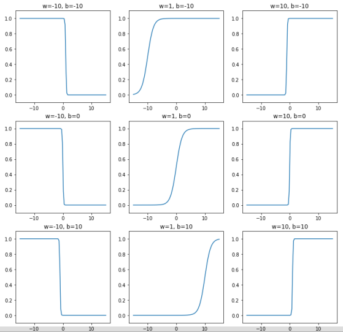
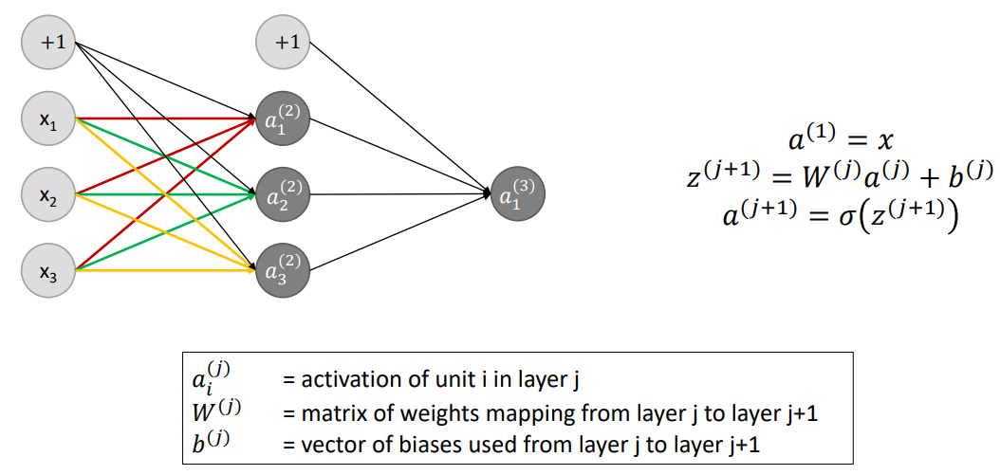
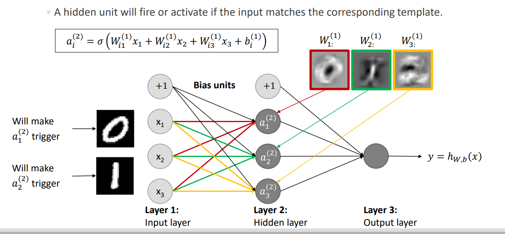
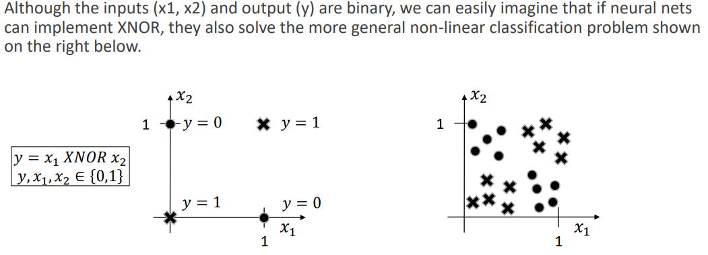

## Traditional neural networks

### Decision boundaries

It can be hard to solve non-linear with linear models as if the data is not linearly separable, the model will not be able to separate the data.

Draw a linear separable problem and one with a non-linear decision boundary.

Solutions:

- Linear transformations: Cartisian to polar coordinates for the circle example
- Neural networks \*

### Universal approximation theorem

Trying to approximate a function (imagine a complex curved line in 2D). We can approximate the function with a lot of bar plot towers. Use two sigmoid functions to approximate the towers.

$b$ moves thr function along the $x$-axis. $w$ controls how steep the sigmoid is.

$$
y = \frac{1}{1 + e^{-wx + b}}
$$

### Neural networks (NNs)

#### Perceptron

A neuron that takes a vector of inputs $x$ and weights $w$ and outputs a single value $y$ dependent on a bias $\theta$.

$$
y = 1 \text{ if } \sum_{i=1}^n w_i \cdot x_i - \theta \geq 0 \text{ else } 0\\
y = 1 \text{ if } w^Tx - \theta \geq 0 \text{ else } 0
$$

#### Logistic unit

Perceptrons do not work very well with gradient descent as there are either no changes to $y$ made by changes to $w$ or dramatic changes from 0 to 1.

Instead use activation function. E.g. the sigmoid with an added bias unit.

$$
h_{w,b}(x) = \frac{1}{1 + e^{-w^Tx + b}}
$$

For a large $|-w^Tx + b|$ the gradient of $h_{w,b}(x)$ is close to 0. This is bad for gradient descent.

#### Forward propagation

Multi-layer NN have several layers and you have layers that learn features of features.

### Implementing XNOR with NNs

You can have a NN solve general problems like AND, XOR, XNOR

$$
W = [20, 20], b = -30\\
\sigma(x) = \frac{1}{1 + e^{-x}}\\
h_w(x) = \sigma(W^Tx + b)
$$

Example for AND

| $x_1$ | $x_2$ |        $h_w(x)$         |
| :---: | :---: | :---------------------: |
|  $0$  |  $0$  | $\sigma(-30)\approx 0$  |
|  $0$  |  $1$  | $\sigma(-10)\approx 0$  |
|  $1$  |  $0$  | $\sigma(-10) \approx 0$ |
|  $1$  |  $1$  | $\sigma(10) \approx 1$  |

You can built out the XNOR with the AND and OR gates.

| $x_1$ | $x_2$ | $x_1 \\\texttt{ AND } \\x_2$ | $\texttt{NOT}(x_1)\\ \texttt{ AND } \\\texttt{NOT}(x_2)$ | $\texttt{OR}$ |
| :---: | :---: | :--------------------------: | :------------------------------------------------------: | :-----------: |
|  $0$  |  $0$  |              0               |                            1                             |       1       |
|  $0$  |  $1$  |              0               |                            0                             |       0       |
|  $1$  |  $0$  |              0               |                            0                             |       0       |
|  $1$  |  $1$  |              1               |                            0                             |       1       |

### Multi-class classification with NNs

Recall that you can solve a 2-class classification problem with a single neuron. For a multi-class classification problem, you can use a softmax unit.

For this you have multiple neurons at the end of the network.

$$
h_{W,b}(x) = \begin{bmatrix}
    P(y=1|x;W,b) \\
    P(y=2|x;W,b) \\
    \vdots \\
    P(y=k|x;W,b)
\end{bmatrix} = \frac{1}{\sum^K_j \exp(w^T_j x + b_j)}\begin{bmatrix}
    \exp(w^T_1 x + b_1) \\
    \exp(w^T_2 x + b_2) \\
    \vdots \\
    \exp(w^T_k x + b_k)
\end{bmatrix}
$$

Notice that the output is normalized so that the probabilities sum to 1.

If inputs can have multiple labels, you can use sigmoid units.

$$
\begin{bmatrix}
    \sigma(w^T_1 x + b_1) \\
    \sigma(w^T_2 x + b_2) \\
    \vdots \\
    \sigma(w^T_k x + b_k)
\end{bmatrix}
$$

### Loss functions

We require a "goal" to hit. These are called one-hot vectors $y = \begin{bmatrix} 0, 1, 0, \cdots, 0 \end{bmatrix}^T$. Where one class is represented by 1 and the rest by 0.

We use the softmax loss function where we have both the 0 elements and the 1 elements contribute to the loss function below.

$$
J(W,b) = \frac{1}{n}\sum_{i=1}^n \sum_{k=1}^K y^{(i)}_k \log (h_{W,b}(x^{(i)})_k) + (1 - y^{(i)}_k) \log (1 - h_{W,b}(x^{(i)})_k)
$$

We can simplify with quadratic loss function.

$$
J(W,b) = \frac{1}{2}\frac{1}{n}\sum_{i=1}^n \sum_{k=1}^K  (h_{W,b}(x^{(i)})_k - y^{(i)}_k)^2
$$

### Optimization – backpropagation

We need to be able to calculate the gradient of the loss function with respect to the weights and biases.

$$
  \frac{\partial J(W,b)}{\partial W}\\
  \frac{\partial J(W,b)}{\partial b}
$$

Approximating the gradient would require a forward pass for each combination of $l,i$ and $j$ to calculate $J(W_{ij}^{(l)} + \epsilon e_j)$.

This would be extremely slow. Instead we use **backpropagation**

#### Forward propagation

First step: Do **forward propagation**.

Each of these values $a, w, z, b$ are vectors.

$$
\begin{align*}
a^{(i)} &= x^{(i)}\\
z^{(l+1)} &= W^{(l)}a^{(l)} + b^{(l)}\\
a^{(l+1)} &= \sigma(z^{(l+1)})
\end{align*}
$$

#### Backpropagation

$\delta^{(l)}_j$ is the error of unit $j$ in layer $l$.

Let $L$ denote the number of layers in the network.

$$
\begin{align*}
    \delta^{(L)} &= (a^{(L)} - y^{(k)}) \odot \sigma'(z^{(L)})\\
    \delta^{(l)} &= ((W^{(l)})^T \delta^{(l+1)}) \odot \sigma'(z^{(l)})
\end{align*}
$$

There is no term for $\delta^{(1)}$ as there is no error for the input layer.

#### Algorithm

Let $\{y^{(k)}, x^{(k)} \}^n_{k=1}$ denote the training set.

Set $\Delta W^{(l)}_ij = 0$ and $\Delta b^{(l)}_i = 0$ for all $l,i,j$.

For $k=1$ to $n$:

1. Set $a^{(1)} = x^{(k)}$
2. Perform forward propagation to calculate all $a^{(l)}$ for $l = 2, \cdots, L$
3. Using $y^{(k)}$, compute $\delta^{(L)} = (a^{(L)} - y^{(k)}) \odot \sigma'(z^{(L)})$
4. Compute $\delta^{(L-1)}, \cdots, \delta^{(2)}$
5. Set $\Delta W^{(l)}_{ij} = \Delta W^{(l)}_{ij} + a^{(l)}_j \delta^{(l+1)}_i$
6. Set $\Delta b^{(l)}_i = \Delta b^{(l)}_i + \delta^{(l+1)}_i$
7. Calculate the gradients

$$
\frac{\partial J(W,b)}{\partial W^{(l)}_{ij}} = \frac{1}{n} \Delta W^{(l)}_{ij}\\
\frac{\partial J(W,b)}{\partial b^{(l)}_i} = \frac{1}{n} \Delta b^{(l)}_i
$$

8. Update weights and biases (gradient descent) with $\alpha$ as the learning rate.

$$
W^{(l)}_{ij} = W^{(l)}_{ij} - \alpha \frac{\partial J(W,b)}{\partial W^{(l)}_{ij}}\\

b^{(l)}_i = b^{(l)}_i - \alpha \frac{\partial J(W,b)}{\partial b^{(l)}_i}
$$

[Go back](main.md)
